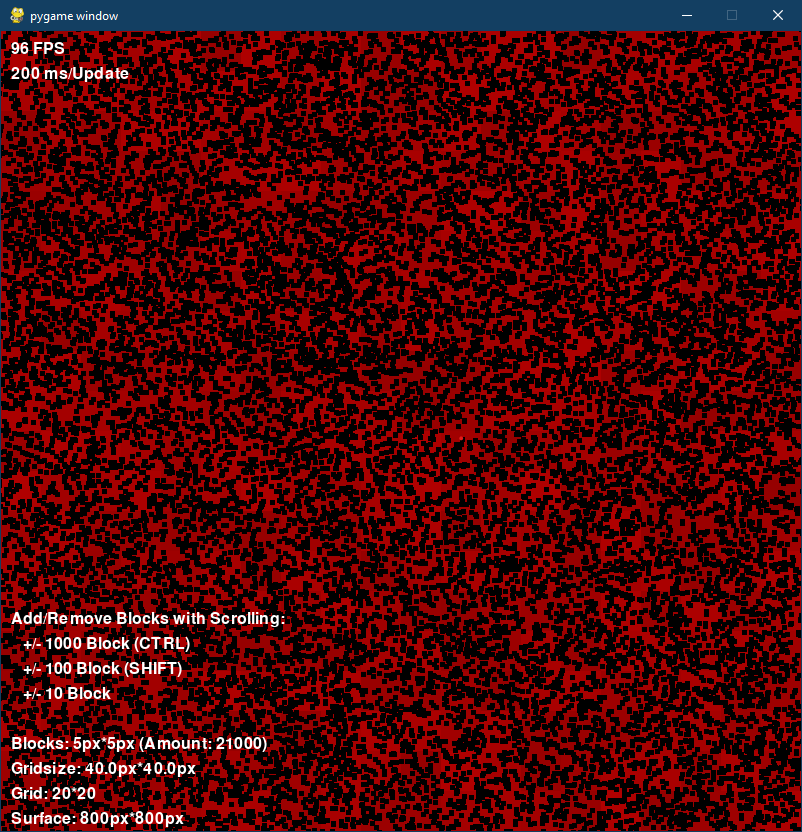

# PyGameTest
Tests the capabilites of PyGame by using pygame with hardware accelerated and doublebuffered surface using sprites.

- The grid on the surface continously updates the Alpha of the cells with random values after `GRID_UPDATE_INTERVAL = 200[ms]`.
- Sprites are added to the screen with an initial random angle, bouncing off the Screen.

## HowTo
Adding/Removing Sprites:
- 10 Sprites:   <kbd>SCROLL-[↓/↑]</kbd> 
- 100 Sprites:  <kbd>⇧ SHIFT</kbd> + <kbd>SCROLL-[↓/↑]</kbd> 
- 1000 Sprites: <kbd>^ Ctrl</kbd> + <kbd>SCROLL-[↓/↑]</kbd> 

### Install
`$ pip install -r requirements.txt`

### Configure
Settings in `config.ini`

## Screenshot
